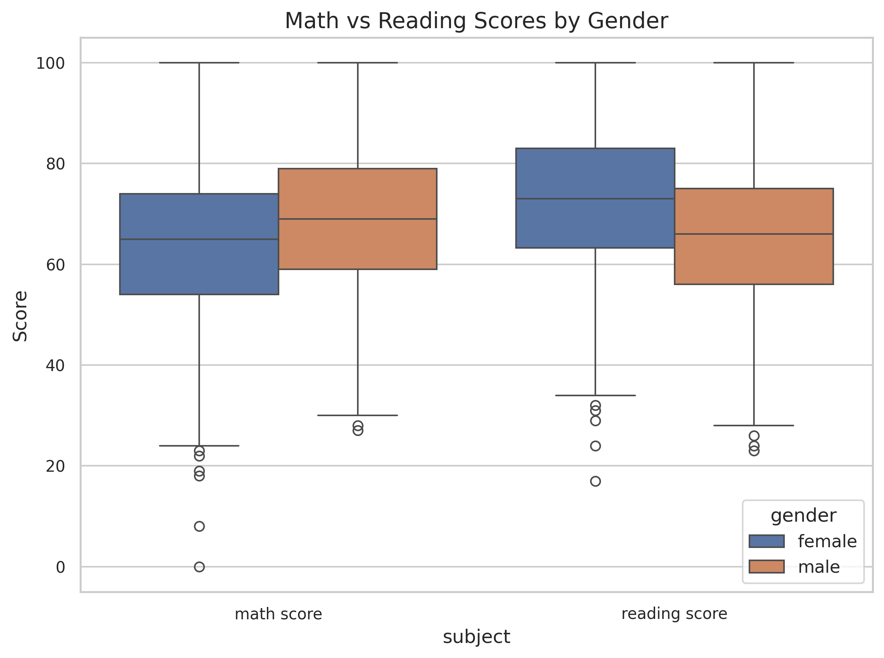
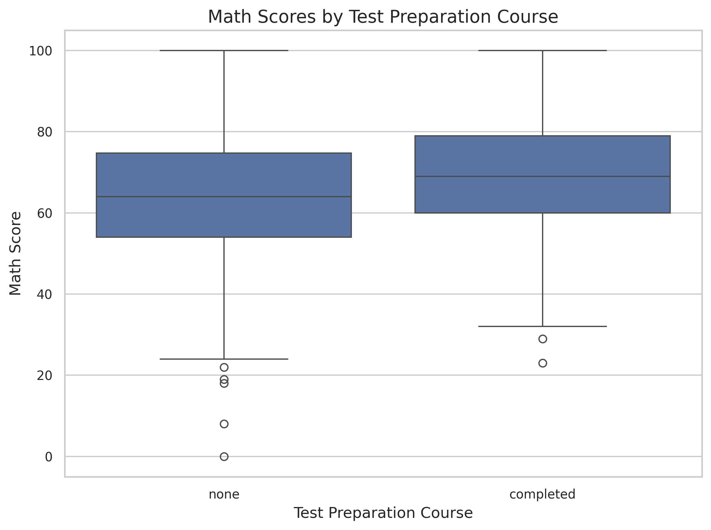
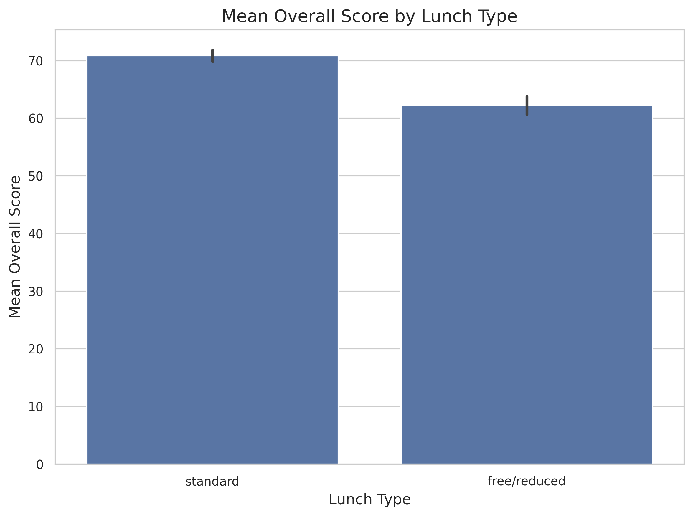
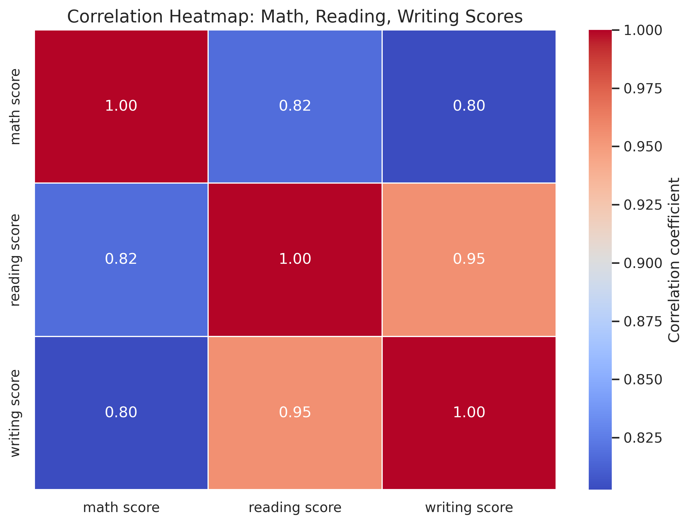
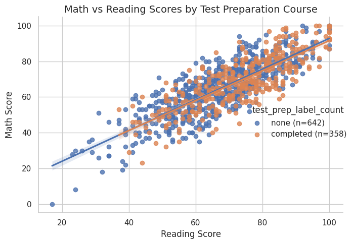

# Findings Report

## Gender boxplots

### Report: 
##### Based on the graph, we can see clear gender differences in Math and Reading scores. Overall, students performed better in Reading than in Math. Males tended to score higher in Math, while females generally scored higher in Reading. Additionally, male students had more outliers on the lower end of the scores compared to females, indicating greater variability. This analysis suggests that gender may be associated with differences in performance between these two subjects.

## Test prep impact on math

### Report: 
##### Based on the graph, we can see clear differences between students who completed the test preparation course and those who did not. Students who completed the course generally performed slightly better than those who did not. Additionally, the group of students who did not complete the course shows more outliers, indicating a wider spread of scores. In contrast, the completed group has less variability, with scores more tightly clustered around the median. This suggests that completing the test preparation course may be associated with more consistent and slightly higher performance.

## Lunch type and average performance

### Report: 
##### This graph shows the differences in mean scores for students based on lunch type, either standard or free/reduced. Overall, students with a standard lunch performed slightly better than those with a free or reduced lunch. Although both groups have mean scores between 60 and 75, the difference is noticeable. The spread of scores appears similar for both groups, indicating comparable variability. This suggests that while lunch type may have a small effect on performance, the impact is not very large.

## Subject correlations

### Report: 
##### This heat map shows the correlations between Math, Reading, and Writing scores. Based on the data, Reading and Writing scores are more strongly correlated with each other than with Math. The difference between Reading and Writing is small, with a correlation of approximately 0.95. In contrast, the correlations between Math and the other two subjects are lower, around 0.80. This suggests that performance in Reading and Writing is closely related, whereas Math appears somewhat independent of the other subjects.

## Math vs reading with trend lines by test prep

### Report: 
##### The scatter plot shows that Math and Reading scores have a positive relationship; as Math scores increase, Reading scores tend to increase as well. Students who completed the test preparation course generally perform better overall than those who did not. The group of students without test preparation shows more spread in their scores, indicating greater variability. In contrast, the completed test prep group’s scores are more tightly clustered around higher values. This suggests that completing the test preparation course is associated with both higher and more consistent performance in Math and Reading.